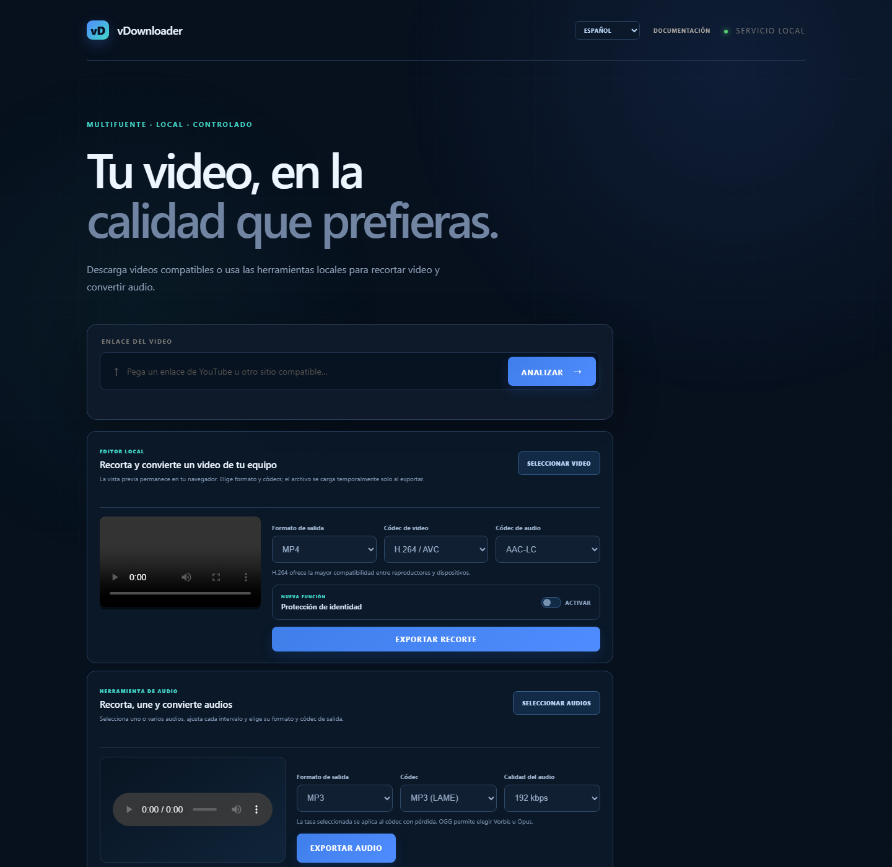

# vDownloader

[](https://github.com/dafermen/avDownloader/actions/workflows/linux-ci.yml)
[](LICENSE)

Local, general-purpose web application for analyzing public videos from **YouTube**, **XVideos**, **Pornhub**, and **XNXX**, or trimming, joining, and transcoding local video and audio files.

> Use this project only with content you have the right to download. Follow each provider's terms and applicable law. Adult-content providers are intended only for people aged 18 or older.

## Application preview

The image below is a real capture of the application running locally on port
5177. It uses an empty workspace so no private media, signed provider URL, or
administrator token is exposed.



## Features

- Automatic provider detection.
- Spanish and English interface with a device-local language preference.
- MP4 and HLS qualities, including high resolutions when available.
- Preview through HLS.js and a restricted local proxy.
- Visual trimming with start, end, and precision controls.
- Local MP4, M4V, MOV, and WebM editor with preview, trimming, and allowlisted
  MP4/MOV/WebM/MKV output profiles using H.264, H.265, or VP9.
- Local audio editor for MP3, M4A, AAC, WAV, FLAC, OGG, and Opus sources,
  with per-source trimming, ordered joining, and MP3, M4A, OGG, Opus, FLAC,
  or WAV output.
- Identity protection for local files: detection, anonymous person selection,
  manual point correction, missing-region creation, full-path review, and moving pixelation.
- Temporary upload with progress; the source is sent only when exporting.
- Remote H.264 sources copied without transcoding; local uploads use the
  explicitly selected compatible container/video/audio codec profile.
- Configurable FFmpeg process queue.
- Progress, estimated time, cancellation, and intelligent retries.
- Rate-aware progress polling that respects HTTP `Retry-After` without marking
  an active media job as failed.
- Automatic refresh of temporary CDN links.
- Persistence and recovery after restart.
- Resumable downloads through HTTP ranges.
- Local history and global job panel.
- Administrative job restart while preserving quality and trim range.
- Bulk restart, status/provider/date filters, expired-file cleanup, job event
  history, storage controls, and administrative audit.
- Storage quota with cleanup of old files.
- Modular provider architecture and SSRF protection through allowlists.
- Maintainable YouTube integration through local `yt-dlp`.
- Automatic merging of adaptive YouTube video and audio.
- Operational diagnostics for FFmpeg, yt-dlp, queue, and storage.
- JSON logs suitable for `journald` and configurable retention.
- Opaque references: signed URLs are never sent to the browser or persisted.
- System-managed multimedia tools on Linux.
- Ubuntu continuous integration through GitHub Actions.
- Remote access disabled by default, with optional bearer profiles, owner
  isolation, per-user job limits, rate limiting, failed-authentication blocking,
  HTTPS enforcement, security headers, and least-privilege FFmpeg spawning.

## Requirements

- Node.js 20 or later.
- npm 10 or later recommended.
- Linux: system-installed `ffmpeg` and `yt-dlp`, or paths supplied through environment variables.
- Windows development: packages retain local binaries as a fallback.

On Linux, vDownloader searches for `ffmpeg` and `yt-dlp` in `PATH`. It does not use `.exe` files or copy Windows binaries.

## Supported sites

| Site | Supported video URL | Detected sources |
|---|---|---|
| YouTube | `https://www.youtube.com/watch?v=<id>`, `youtu.be/<id>`, `/shorts/<id>`, and `/live/<id>` | Combined MP4 or adaptive video + audio |
| XVideos | `https://www.xvideos.com/video.<id>/<slug>` | MP4 and HLS |
| Pornhub | `https://<language>.pornhub.com/view_video.php?viewkey=<id>` | HLS and published variants |
| XNXX | `https://www.xnxx.com/video-<id>/<slug>` | MP4 and HLS |
| Local file | MP4, M4V, MOV, or WebM selected from the computer | Trim and convert to MP4, MOV, WebM, or MKV with compatible H.264/H.265/VP9 and AAC/Opus profiles |
| Local audio | One or more MP3, M4A, AAC, WAV, FLAC, OGG, or Opus files | Per-source trimming, ordered joining, and MP3/M4A/OGG/Opus/FLAC/WAV transcoding |

Only individual public video pages are supported. Home pages, searches, profiles, categories, full playlists, private or sign-in-gated content, and unregistered mirror domains are not accepted. A YouTube `/live/<id>` URL is processed when it refers to an accessible recording. Final quality depends on the variants published by each site for that video.

## Installation

On Debian/Ubuntu, install the system tools first. `pipx` is recommended for keeping yt-dlp current:

```bash
sudo apt update
sudo apt install -y ffmpeg pipx
pipx install yt-dlp
```

Then install the application:

```bash
git clone https://github.com/dafermen/avDownloader.git
cd avDownloader
YOUTUBE_DL_SKIP_DOWNLOAD=true YOUTUBE_DL_SKIP_PYTHON_CHECK=1 npm ci
npm start
```

If the Windows installation reports that Python cannot be found:

```powershell
$env:YOUTUBE_DL_SKIP_PYTHON_CHECK = '1'
npm install
```

Open [http://localhost:5177](http://localhost:5177).

For development:

```bash
npm run dev
```

To run tests:

```bash
npm test
```

Before any release or deployment, run the complete quality gate:

```bash
npm run verify:deploy
```

It evaluates acceptance, unit, property/invariant, mutation, fuzz,
integration, contract, end-to-end, regression, security, concurrency and
resilience, performance and resource, and compatibility and deployment tests.
It also runs syntax checks and the production dependency audit, then writes a
local report to `reports/predeploy-report.json`. Deployment remains blocked
until the manual [`docs/RELEASE_CHECKLIST.md`](docs/RELEASE_CHECKLIST.md) is
also completed.

To update the local YouTube extractor on Linux or Windows:

```bash
npm run update:yt-dlp
```

If yt-dlp was installed with pipx on Linux, you can also update it with `pipx upgrade yt-dlp`.

## Complete documentation

With the service running, open:

**[http://localhost:5177/docs.html](http://localhost:5177/docs.html)**

The page includes the user guide, architecture, API, configuration, code map, student guide, providers, persistence, security, testing, troubleshooting, and glossary.

You can also open it from the **Documentation** button on the main page. Project documentation is maintained in English; the application interface itself supports Spanish and English.

## Configuration

| Variable | Default | Description |
|---|---:|---|
| `PORT` | `5177` | Local HTTP port. |
| `MAX_CONCURRENT_JOBS` | `2` | Concurrent FFmpeg processes, from 1 to 8. |
| `MAX_JOB_RETRIES` | `2` | Additional retries, from 0 to 5. |
| `MAX_STORAGE_GB` | `10` | Quota for prepared files. |
| `JOB_DIR` | `data/jobs` | Persistent directory for jobs, temporary sources, and completed media files. |
| `JOB_TTL_MINUTES` | `60` | Minutes to retain terminal jobs and files, from 5 to 10080. |
| `FFMPEG_PATH` | Linux: `ffmpeg` | FFmpeg command or absolute path. |
| `YT_DLP_PATH` | Linux: `yt-dlp` | yt-dlp command or absolute path. |
| `ADMIN_TOKEN` | empty | Token required to restart jobs from remote computers. When empty, administration works only from localhost. |
| `MAX_UPLOAD_GB` | `2` | Maximum size of a temporary local source; cannot exceed `MAX_STORAGE_GB`. |
| `REMOTE_ACCESS_ENABLED` | `false` | Enables authenticated network access; otherwise the service binds to loopback only. |
| `ACCESS_TOKENS_JSON` | `[]` | JSON profiles with `id`, strong `token`, `role`, and optional `maxActiveJobs`. |
| `MAX_ACTIVE_JOBS_PER_USER` | `4` | Default active-job limit for authenticated users. |
| `RATE_LIMIT_MAX` | `120` | Maximum general API requests per address per minute. |
| `HTTPS_KEY_PATH` / `HTTPS_CERT_PATH` | empty | Built-in TLS key and certificate paths; configure both. |
| `TRUSTED_HTTPS_PROXY` | `false` | Confirms that a trusted reverse proxy terminates HTTPS. |

PowerShell example:

```powershell
$env:MAX_CONCURRENT_JOBS = 3
$env:MAX_JOB_RETRIES = 2
$env:MAX_STORAGE_GB = 20
$env:JOB_TTL_MINUTES = 120
$env:JOB_DIR = 'D:\vDownloader-jobs'
$env:ADMIN_TOKEN = 'change-this-secret'
$env:MAX_UPLOAD_GB = 4
npm start
```

## Architecture overview

```text
Browser
  │  JSON / local HLS
  ▼
Node.js server
  ├── provider registry
  ├── page and CDN validation
  ├── opaque selections and media
  ├── queue and persistence
  ├── refresh and retries
  └── resumable video and audio downloads
        │
        ▼
      FFmpeg
        │
        ▼
      Final MP4 / MOV / WebM / MKV / audio output
```

## Structure

```text
providers/       YouTube, XVideos, Pornhub, and XNXX integrations
public/          Web interface, translations, and documentation
docs/            Architecture, API, development, testing, deployment, and operations
test/            Test suites grouped by quality concern
deploy/          Hardened systemd and Nginx starting templates
.github/         Linux CI, issue forms, and pull request template
scripts/         Maintenance and deployment quality-gate commands
data/jobs/       Persisted state and prepared files
server.js        API, queue, FFmpeg, persistence, and proxy
AGENTS.md        Mandatory rules for future Codex sessions
CURRENT_STATUS.md Current state, validation, and next steps
CHANGELOG.md      Release history
CONTRIBUTING.md   Contribution and quality requirements
LICENSE          MIT license for project-owned code
```

## Main API

- `POST /api/analyze`: analyzes a URL and returns qualities with `selectionId`, without CDN URLs.
- `POST /api/jobs`: creates a job with `{ "selectionId": "uuid", "start": 0, "end": 30 }`.
- `POST /api/upload-jobs`: receives a local video as a binary body and creates a trim/transcode job.
- `POST /api/audio-jobs`: receives one local audio file, trims it, and transcodes it with an allowlisted format/codec profile.
- `POST /api/audio-join-jobs`: streams two to twenty ordered audio sources plus bounded metadata and creates one join/transcode job.
- `POST /api/identity-tracks`: validates face tracking and returns a single-use UUID reference.
- `GET /api/jobs`: lists jobs and statistics.
- `GET /api/jobs/:id`: retrieves a job.
- `DELETE /api/jobs/:id`: cancels or deletes a job.
- `POST /api/jobs/:id/restart`: administratively restarts a job and responds with HTTP 202.
- `GET /api/jobs/:id/download`: downloads the completed video or audio file with HTTP range support.
- `GET /api/media/:id`: opaque proxy for previews, manifests, and segments.
- `GET /api/health`: status, versions, queue, retention, and dependencies.

## Trim a local file

1. Select **Select video** in the local editor.
2. The browser creates a preview without sending the file.
3. Set the start and end with the timeline, fields, or player.
4. Optionally enable **Identity protection**, adjust margin and intensity, and select **Detect faces**.
5. Select the anonymous people that should be protected. Add, move, resize, or
   delete regions at individual sampled points when detection needs correction.
6. Select **Review full path**, watch the complete protected range, and confirm
   the visual review.
7. Choose MP4, MOV, WebM, or MKV and a compatible video/audio codec pair.
8. Select **Export clip** or **Export with protection**. The temporary upload begins and displays progress.
9. FFmpeg trims and converts the range using the selected server-owned profile.
10. Download the result from the card or panel.

MP4, M4V, MOV, and WebM files up to 12 hours are supported. The default per-file limit is 2 GB and is configured with `MAX_UPLOAD_GB`. The temporary source remains attached to the job to allow an administrative restart and is removed when the job is deleted or expires. Incomplete uploads are also removed.

The preview uses a browser-local `blob:` URL. Uploads require the `x-vdownloader-upload: 1` header, which blocks simple cross-origin requests. Internal file paths never appear in responses.

## Trim, join, and transcode local audio

1. Select one or more MP3, M4A, AAC, WAV, FLAC, OGG, or Opus files.
2. Select each source in the ordered list, preview it locally, and choose its
   own start and end time. Use the arrow controls to change the join order.
3. Choose MP3/MP3, M4A/AAC, OGG/Vorbis or Opus, Opus/Opus, FLAC/FLAC, or
   WAV/PCM. Lossy codecs support the 96–320 kbps allowlist.
4. Select **Export audio**. Only then are the sources uploaded temporarily.
5. FFmpeg normalizes sample rate/channel layout, concatenates the selected
   ranges without gaps, and applies the selected output profile.
6. Download the result from its card or the global job panel.

Audio jobs use the same queue, persistence, storage quota, restart, expiration,
cancellation, owner isolation, and resumable downloads as video jobs. Their
single-source upload contract requires `x-vdownloader-audio: 1` plus the regular
`x-upload-*` headers, `x-audio-format`, `x-audio-codec`, and, for lossy codecs,
`x-audio-bitrate`. A join uses `x-vdownloader-audio-join: 1` and a streaming
binary envelope whose JSON prefix declares only bounded names, sizes, times,
format, and codec. The server maps only the first audio stream from each source
and never accepts a client-provided file path or FFmpeg argument.

### Identity protection

Detection runs in the browser through MediaPipe and the BlazeFace model served by the application. Video is not sent to Google or another recognition service. The application analyzes up to four samples per second, with a maximum of 900, protects every detected face, and expands each region with the selected margin.

To reduce exposure while a person moves, each region is joined to the position detected in the next sample. If the detector briefly loses a face because of a turn or occlusion, the previous and next detections remain connected for up to 1.5 seconds. The default margin is 40%. This conservative coverage may pixelate an area larger than the face, especially during fast movement.

The preview overlays a pixelated canvas on the player. During export, the browser registers normalized coordinates through `POST /api/identity-tracks`; the server returns a temporary, single-use UUID. FFmpeg generates a moving mask, applies `pixelize` only inside the regions, and leaves the rest of the frame unchanged. Tracking remains attached to the job so an administrative restart repeats the same protection.

Automatic detection may miss a small, turned, covered, or poorly lit face. Review the complete exported video before sharing it. This feature reduces visual identifiability but does not remove voices, tattoos, license plates, backgrounds, metadata, or other identity signals.

Upload contract:

```text
POST /api/upload-jobs
Content-Type: video/mp4
Content-Length: <bytes>
x-vdownloader-upload: 1
x-upload-name: <name encoded with encodeURIComponent>
x-upload-duration: <seconds>
x-upload-start: <start second>
x-upload-end: <end second>
x-video-format: <mp4 | mov | webm | mkv>
x-video-codec: <compatible h264 | hevc | vp9>
x-video-audio-codec: <compatible aac | opus>
x-identity-track-id: <optional UUID returned by /api/identity-tracks>

<binary file body>
```

## Job administration

The panel's **Restart** button runs a job again while preserving the source URL, provider, quality, filename, and trim range. The previous output is removed, progress and errors are reset, and signed CDN URLs are refreshed before FFmpeg starts. Administrators can also filter jobs, select several for one bulk restart, clean expired jobs and files, inspect bounded lifecycle history, review storage use, and read the current-process administrative audit.

- On `localhost`, when `ADMIN_TOKEN` is not configured, the operation is available only from the same computer.
- On a remote server, configure `ADMIN_TOKEN` and enter it in **Job administration**. The browser retains it only for the current tab.
- The API requires `x-vdownloader-admin: 1` to block simple cross-origin requests. When a token exists, it is also sent in `x-admin-token`; it must never be placed in the URL.

```bash
curl -X POST \
  -H "x-vdownloader-admin: 1" \
  -H "x-admin-token: $ADMIN_TOKEN" \
  http://localhost:5177/api/jobs/<id>/restart
```

Local mode manages all jobs as the `local` administrator. Remote mode provides
configuration-based user/admin profiles and owner isolation, but it does not
yet include self-service registration, password recovery, an identity
database, or external single sign-on.

### Secure remote mode

The default process binds to `127.0.0.1`; setting `HOST` alone cannot expose it.
Remote mode requires `REMOTE_ACCESS_ENABLED=true`, at least one strong profile
in `ACCESS_TOKENS_JSON`, and either built-in TLS or
`TRUSTED_HTTPS_PROXY=true`. Profiles provide `user` or `admin` authorization,
job ownership, and active-job limits. Browser tokens are kept in
`sessionStorage`, never URLs or persistent history.

This is a lightweight private-server security model, not a full account
system. For public Internet exposure, use a hardened reverse proxy or identity
provider, operating-system sandboxing, network egress controls, monitoring,
backups, and independent security review.

Reviewed starting templates are provided in [`deploy/`](deploy/README.md) for
an unprivileged systemd service and an HTTPS Nginx reverse proxy. The proxy must
overwrite forwarding headers; the application trusts them only when the
immediate peer is loopback, so remote clients cannot inherit localhost
administrator privileges.

## Linux operation

Server output uses one JSON line per event, suitable for `journalctl`. Do not copy `node_modules` from Windows: install FFmpeg and yt-dlp on Linux and run `npm ci` on the server.

If the tools are not in the service's `PATH`, configure absolute paths:

```bash
export FFMPEG_PATH=/usr/bin/ffmpeg
export YT_DLP_PATH=/opt/vdownloader-tools/bin/yt-dlp
npm start
```

The health endpoint responds with HTTP 200 when FFmpeg and yt-dlp are available, and HTTP 503 with `degraded` status when a dependency is missing:

```bash
curl http://localhost:5177/api/health
```

See contracts, inputs, outputs, and states in the [local documentation](http://localhost:5177/docs.html#api).

## CDNs, privacy, and temporary links

Remote videos are not delivered by a project library. Each provider uses its own CDN (`googlevideo.com`, `xvideos-cdn.com`, `phncdn.com`, or `xnxx-cdn.com`) and normally signs links with expiring tokens. vDownloader retains the original page URL to refresh video and audio tracks when needed. Signed URLs remain in memory: the browser receives opaque UUIDs, and `jobs.json` does not store CDN tokens. Local files do not use a CDN; they are stored with a UUID inside `JOB_DIR` for the life of the job.

## Automated Linux testing

The [`.github/workflows/linux-ci.yml`](.github/workflows/linux-ci.yml) workflow
installs FFmpeg and yt-dlp on Ubuntu and runs the same
`npm run verify:deploy` gate on every pull request and push to `main`.
The full policy and category commands are in
[`docs/TESTING.md`](docs/TESTING.md).

`localhost` describes where the application runs; it is not an offline mode or a license exception. Analyzing and preparing a file requires connecting to the provider. The interface is self-contained: HLS.js, styles, scripts, favicon, and fonts are served locally; it does not use Google Fonts or another interface CDN.

## Third-party licenses

| Component | Declared license |
|---|---|
| `ffmpeg-static` 5.2.0 | GPL-3.0-or-later |
| HLS.js 1.6.13 | Apache-2.0 |
| `@mediapipe/tasks-vision` 0.10.35 and BlazeFace | Apache-2.0 |
| `youtube-dl-exec` 3.0.22 | MIT |
| yt-dlp | Unlicense; its artifacts may include components under other licenses |

The inventory, redistribution considerations, and distinction between software licenses and content rights are documented in [THIRD_PARTY_LICENSES.md](THIRD_PARTY_LICENSES.md).

## Contributing

1. Create a descriptive branch.
2. Keep the change focused.
3. Add or update tests.
4. Run `npm test`.
5. Run `npm run verify:deploy` before release or deployment.
6. Complete the manual release checklist.
7. Update the README and web documentation when behavior changes.
8. Open a pull request explaining the problem, solution, and evidence.

Before starting a new development session, read [`AGENTS.md`](AGENTS.md) and [`CURRENT_STATUS.md`](CURRENT_STATUS.md). After a functional change, update `CURRENT_STATUS.md` with executed tests, real pending work, and important decisions.

Do not commit videos, cookies, CDN tokens, or files from `data/jobs`.

## License

Project-owned vDownloader code is distributed under the [MIT license](LICENSE). Dependencies and binaries retain their independent licenses described in [THIRD_PARTY_LICENSES.md](THIRD_PARTY_LICENSES.md).

## Portfolio demo access

[Open the protected demo](https://avdownloader.innovalogic.tech/). The external test-server
gateway supports optional `DEMO_MODE` and private `DEMO_PASSWORD` settings.
See [configuration and limits](docs/DEMO_MODE.md) and the
[secret-free env template](deploy/demo-access/.env.example). These settings belong
to the server gateway; the local application does not read them automatically.
